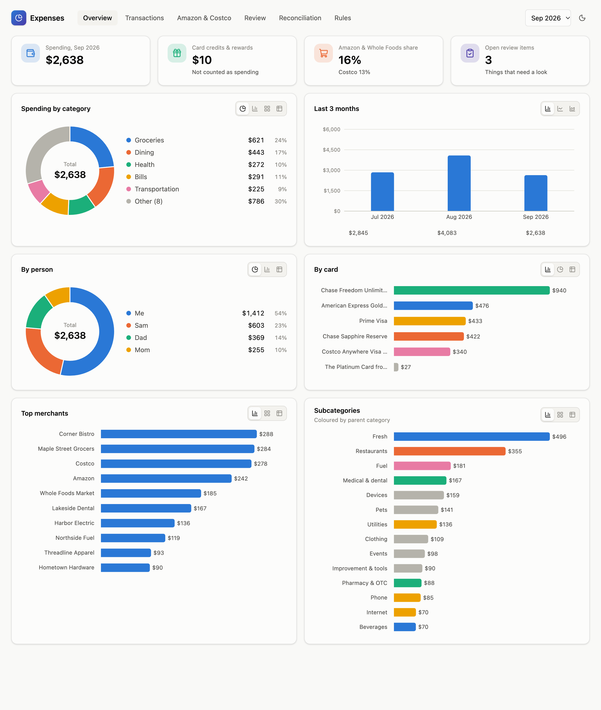
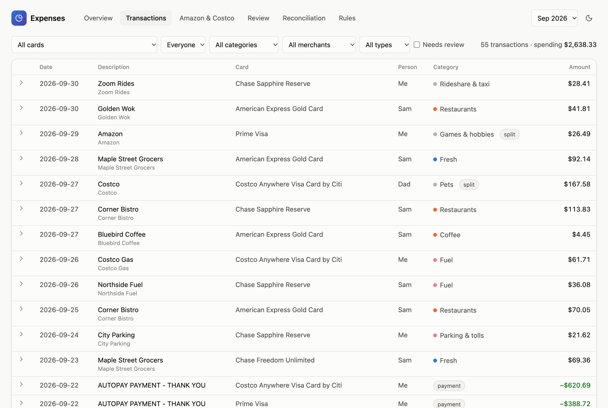
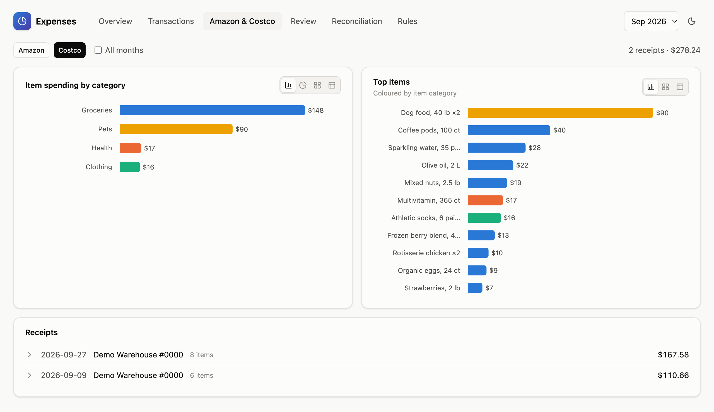
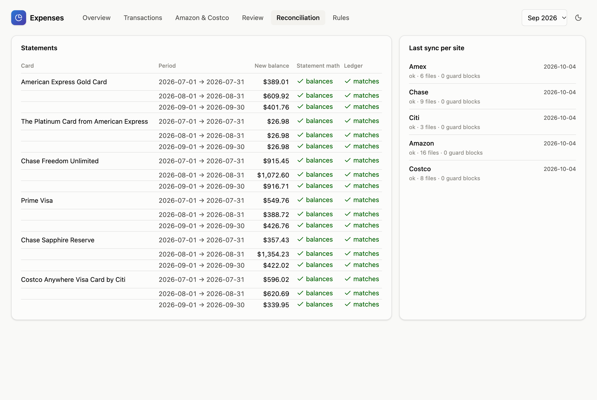

# Financial Adviser

A local-first expense tracker for credit cards. It shows where your money goes, down to the
item for Amazon and Costco, and checks every number against your bank statements.

- **No aggregators, no cloud.** Nothing goes to Plaid or a hosted service. Your data lives in one
  SQLite file on your Mac.
- **AI fetches, code counts.** Browsing agents (Claude Code driving Chrome through
  [Playwright MCP](https://github.com/microsoft/playwright-mcp)) download your statements, activity
  exports, invoices and receipts, the way you would by hand. Python then parses everything and
  checks it with arithmetic.
- **Reconciled to the cent.** Each statement's summary must balance, and the transactions must
  add up to it exactly.
- **Item-level splits.** An Amazon order or a Costco receipt is matched to its card charge, and
  the charge is split across the items' categories (tax and shipping spread proportionally).
- **A dashboard you can correct.** Fix a category or create a rule in the browser. Your
  corrections survive a full rebuild.

> Status: a personal project, built for one household's cards and stores. It works end to end
> for the sites below. Expect to adapt it for anything else.

<picture>
  <source media="(prefers-color-scheme: dark)" srcset="docs/screenshots/overview-dark.png">
  
</picture>

<details>
<summary>More screenshots</summary>

**Transactions**: filters, category dots, item splits



**Amazon & Costco**: item-level spending from receipts



**Reconciliation**: every statement balances and matches the ledger



</details>

<sub>Screenshots use mock data: a fictional household, made-up merchants and products
(`make screenshots` regenerates them).</sub>

## Supported sources

| Source | What is collected | Notes |
|---|---|---|
| Chase | activity CSV, statement PDFs | closed periods come from statements |
| Citi (Costco Anywhere Visa) | activity CSV, statement PDFs | per-cardholder sections |
| American Express | activity CSV, statement PDFs | statement credits kept separate from spending |
| Amazon | printable invoices, Your Payments → Transactions | charges matched by order number |
| Costco | warehouse receipts | uses your own Chrome via the Playwright Extension |

Gmail receipts are designed (SPEC Phase 4) but not built.

## How it works

```
fin sync <site>   Claude Code + Playwright MCP drive Chrome; you log in yourself
      │           → statements, CSVs, invoices, receipts + manifest.json
      ▼
fin import        parse → SQLite (raw files kept immutable under raw/)
      ▼
fin process       link statement lines ↔ CSV rows → merchant rules → AI categories (cached)
                  → match Amazon/Costco orders to charges → item splits
                  → statement ledger check → review queue
      ▼
fin serve         FastAPI + React dashboard on 127.0.0.1
```

## Safety model

The browsing agent works on logged-in bank sessions, so it is boxed in on several layers:

- **You do every login.** The agent never types into login, password, PIN or verification-code
  fields, and nothing stores your site passwords. Nothing tries to get past bot detection.
- **Read-only by design.** A guard hook (`sync/guard.py`) checks every browser action and file
  write. It blocks:
  - navigation off the site's domains
  - clicks on payment, transfer, buy, enroll, redeem and settings controls
  - typing into login fields
  - writes outside the run folder
- **Minimal tools.**
  - The session gets browser tools and file writes only: no shell, no file reads, no web fetch.
  - Dangerous Playwright tools (script evaluation, file upload, network inspection) are removed.
  - Page-registered WebMCP tools and Claude in Chrome are off.
- **One site per session, with its own Chrome profile** (Costco is the exception; see below).
- **Approve mode** prompts you for every click until a site has two clean runs.
- **No transcripts.** Browsing sessions don't save Claude Code transcripts, and logs record
  decisions, never page content.
- **The classifier sees as little as possible.** It runs as `claude -p` with Claude haiku and no
  tools. It only sees cleaned merchant names, amounts, dates and item titles.

This is defense in depth, not a guarantee. Watch the browser while a sync runs.

## Requirements

- macOS with FileVault on, Google Chrome, [uv](https://docs.astral.sh/uv/), Node.js (LTS)
- [Claude Code](https://claude.com/claude-code), signed in with a Claude subscription.
  API keys are deliberately not used (`fin doctor` checks this).
- For Costco only: the [Playwright Extension](https://chromewebstore.google.com/detail/playwright-extension/mmlmfjhmonkocbjadbfplnigmagldckm)
  in your Chrome.

## Setup

```bash
uv sync
cp config/cards.example.json config/cards.json   # then edit: your people, cards and sites
uv run fin init        # data dir (~/FinancialAdviserData, mode 700), database, git hook
uv run fin doctor      # FileVault, Claude auth, Chrome, Node, permissions
uv run fin sync selftest   # checks the browsing setup against example.com
```

`config/cards.json` is gitignored. Your data directory (set with `FIN_DATA_DIR`) must not live
under iCloud-synced folders.

## Everyday use

```bash
make                 # list everything
make weekly          # sync each site (you log in), process, back up, open the dashboard
make sync SITE=chase
make process         # add NO_AI=1 to skip AI
make serve           # dashboard on http://127.0.0.1:8765 until Ctrl+C
make review          # open review items, in the terminal
```

All `make` targets run in the foreground. Other commands:

- `fin import FILE` handles manual downloads, detected by their content.
- `fin rebuild` regenerates everything from `raw/` and keeps your corrections.
- `fin backup` makes an online SQLite backup.

**Costco.** Costco's account pages don't load in a separate automated Chrome profile, so its sync
connects to your own Chrome through the Playwright Extension:

1. Save the extension's token to `~/FinancialAdviserData/secrets/playwright_extension_token`
   (mode 600).
2. Open a fresh Chrome window and keep it in front while the sync runs.

## Dashboard

- **Overview:** spending by category, person, card and merchant, plus the 3-month trend. Each
  chart switches between bars, donut, treemap and table views (the choice is remembered).
- **Transactions:** filters, item splits, and category or person corrections.
- **Amazon & Costco:** orders, receipts, top items.
- **Review:** low-confidence AI guesses, unmatched charges, statement mismatches.
- **Reconciliation:** each statement's math and ledger check.
- **Rules:** a rule editor with a live preview.

## Development

```bash
make check     # ruff, pytest (no network, no AI, no browser), type-checked web build
make dev       # live-reload frontend on :5173 plus the API
make screenshots   # README screenshots from a throwaway mock database
```

- Test fixtures are redacted and use fictional names, places and products.
- `scripts/redact.py` makes fixtures from your own files.
- Design notes and every decision live in [`docs/SPEC.md`](docs/SPEC.md) and
  [`docs/decisions.md`](docs/decisions.md).

## Disclaimer

- **No warranty, no advice.** This software is provided as is, with no warranty (see the
  licence). It is not financial, tax or legal advice.
- **Your accounts, your responsibility.** You run it against your own accounts, at your own risk.
  Automated access may be restricted by some banks' and retailers' terms of service, and you are
  responsible for complying with the terms of the sites you use.
- **Not affiliated.** This project is not affiliated with, endorsed by, or sponsored by JPMorgan
  Chase, Citibank, American Express, Amazon, Costco, Anthropic or Microsoft. Their names are used
  only to describe compatibility, and they are trademarks of their respective owners.

## License

Copyright (C) 2026 Prakhar Saxena.

Licensed under the [GNU Affero General Public License v3.0 only](LICENSE) (`AGPL-3.0-only`).
Commercial licences under other terms are available from the copyright holder.

Contributions: please open an issue to discuss before sending code.
